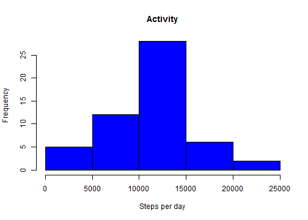
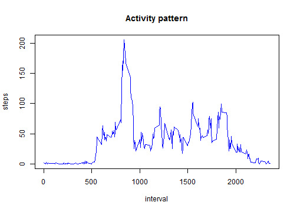
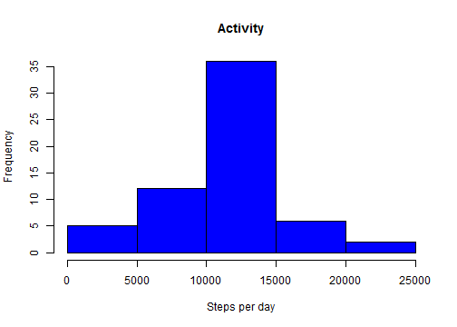
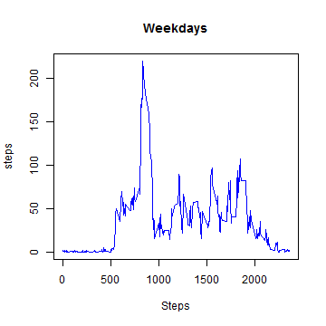
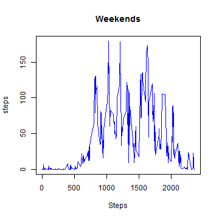

Reproducible Research -  June 2014
==================================
Program Assignment 1 
--------------------
This assignment makes use of data from a personal activity monitoring device. This
device collects data at 5 minute intervals through out the day. The data consists of two months of data from an anonymous individual collected during the months of October and November, 2012 and include the number of steps taken in 5 minute intervals each day.

### Loading and preprocessing the data
After reading the data set, we inspect it with the 'summary' function. It can be seen that there are missing values in it. We will take care of them later.


```r
act <- read.table(dir()[1], sep=",", header=TRUE)
summary(act)
```

```
##      steps               date          interval   
##  Min.   :  0.0   2012-10-01:  288   Min.   :   0  
##  1st Qu.:  0.0   2012-10-02:  288   1st Qu.: 589  
##  Median :  0.0   2012-10-03:  288   Median :1178  
##  Mean   : 37.4   2012-10-04:  288   Mean   :1178  
##  3rd Qu.: 12.0   2012-10-05:  288   3rd Qu.:1766  
##  Max.   :806.0   2012-10-06:  288   Max.   :2355  
##  NA's   :2304    (Other)   :15840
```

### Mean and median total number of steps taken per day
Let's calculate the steps taken each day and plot this in a histogram. We use the aggregate function to obtain the total number of steps per day in a new data frame.


```r
ds <- act    # data set to use
steps.day <- with(ds, aggregate(steps ~ date, act, sum))
colnames(steps.day) <- c("date", "steps")
hist(steps.day$steps, xlab="Steps per day", main="Activity", col="blue")
```

 

In summary

```r
summary(steps.day)
```

```
##          date        steps      
##  2012-10-02: 1   Min.   :   41  
##  2012-10-03: 1   1st Qu.: 8841  
##  2012-10-04: 1   Median :10765  
##  2012-10-05: 1   Mean   :10766  
##  2012-10-06: 1   3rd Qu.:13294  
##  2012-10-07: 1   Max.   :21194  
##  (Other)   :47
```

Mean and median number of steps can be found using the summary function on the obtained data frame. 

```r
summary(steps.day)[3:4,2]
```

```
##                                     
## "Median :10765  " "Mean   :10766  "
```

### Average daily activity pattern
We now try to find a daily activity pattern. We will then plot the average steps taken per interval during a whole day. 

```r
steps.int <- with(act, aggregate(steps ~ interval, act, mean))
with(steps.int, plot(interval, steps, type="l", col="blue", main="Activity pattern"))
```

 

We can see that the peak of activity is around the 800th and 900th intervals, which correspond to 8 and 9 a.m. The precise maximum is found at 8:35 a.m. with a total of 206 steps in the five minute interval, which is roughly about 41 steps per minute.


```r
steps.int[which.max(steps.int$steps),]
```

```
##     interval steps
## 104      835 206.2
```
### Fixing missing values
Let us now see if the number of missing values is significative.

```r
apply(is.na(act), 2, sum)
```

```
##    steps     date interval 
##     2304        0        0
```

In order to avoid these missing values to distort results we will replace them with the average number of steps in the corresponding interval. For doing so, the following function is defined.


```r
avgSteps <- function(ds1) { 
    # creates a new data set replacing nas with avg interval steps
    ds2 <- data.frame(ds1)              # copy the data set
    for (i in 1:nrow(ds2)) {            # loop over all rows in new data set
        if (is.na(ds2[i,"steps"])) {    # check for missing values
            # replace na with the corresponding interval value
            ds2[i,"steps"] <- steps.int[steps.int$interval== 
                                        ds2[i,"interval"],"steps"]
        }   
    }
    ds2                                 # return the new data set
}
```

Now we can generate the new data set.

```r
act2 <- avgSteps(act)
```

Let's see if the new values differ with those found before.

```r
summary(act2)
```

```
##      steps               date          interval   
##  Min.   :  0.0   2012-10-01:  288   Min.   :   0  
##  1st Qu.:  0.0   2012-10-02:  288   1st Qu.: 589  
##  Median :  0.0   2012-10-03:  288   Median :1178  
##  Mean   : 37.4   2012-10-04:  288   Mean   :1178  
##  3rd Qu.: 27.0   2012-10-05:  288   3rd Qu.:1766  
##  Max.   :806.0   2012-10-06:  288   Max.   :2355  
##                  (Other)   :15840
```


```r
ds <- act2   # data set to use
steps.day <- with(ds, aggregate(steps ~ date, ds, sum))
colnames(steps.day) <- c("date", "steps")
hist(steps.day$steps, xlab="Steps per day", main="Activity", col="blue")
```

 

Mean and median number of steps can be found using the summary function on the obtained data frame. 

```r
summary(steps.day)
```

```
##          date        steps      
##  2012-10-01: 1   Min.   :   41  
##  2012-10-02: 1   1st Qu.: 9819  
##  2012-10-03: 1   Median :10766  
##  2012-10-04: 1   Mean   :10766  
##  2012-10-05: 1   3rd Qu.:12811  
##  2012-10-06: 1   Max.   :21194  
##  (Other)   :55
```

In particular the new median and mean values of steps take per day are: 

```r
summary(steps.day)[3:4,2]
```

```
##                                     
## "Median :10766  " "Mean   :10766  "
```

### Activity patterns of weekdays and weekends
In order to determine if there are differences in the patterns of steps between weekdays and weekends we defined the following simple function:


```r
weekend <- function(dat) {
    # returns true if date is Saturday or Sunday, false otherwise.
    dayofweek <- weekdays(as.Date((as.character(dat))))
    ((dayofweek == "sabado") | (dayofweek == "domingo"))
}
```
With function 'weekend' we can now create a new column 'dayofweek' in the data frame using factor labels 'weekday' and 'weekend' to identify both situations. We can then proceed to compute the average number of steps per interval for weekdays and weekends.


```r
act2[,4] <- factor(weekend(act2[,2]), labels=c("weekday", "weekend"))
colnames(act2)[4] <- "dayofweek"
head(act2,3)
```

```
##    steps       date interval dayofweek
## 1 1.7170 2012-10-01        0   weekday
## 2 0.3396 2012-10-01        5   weekday
## 3 0.1321 2012-10-01       10   weekday
```

```r
wends <- act2[act2[,4] == "weekend",]
wends.steps <- with(wends, aggregate( steps ~ interval, wends, mean))
wdays <- act2[act2[,4] == "weekday",]
wdays.steps <- with(wdays, aggregate( steps ~ interval, wdays, mean))
```

### Step Patterns 
Finally, we are ready to plot results. It is clear that steps pattern are quite different, showing much more variability during weekends than during weekdays.


```r
ds1 <- wdays.steps
tit1 <- "Weekdays"
ds2 <- wends.steps
tit2 <- "Weekends"
with(ds1, plot(interval, steps, type="l", col="blue", main=tit1, xlab="Steps"))
with(ds2, plot(interval, steps, type="l", col="blue", main=tit2, xlab="Steps"))
```

  
